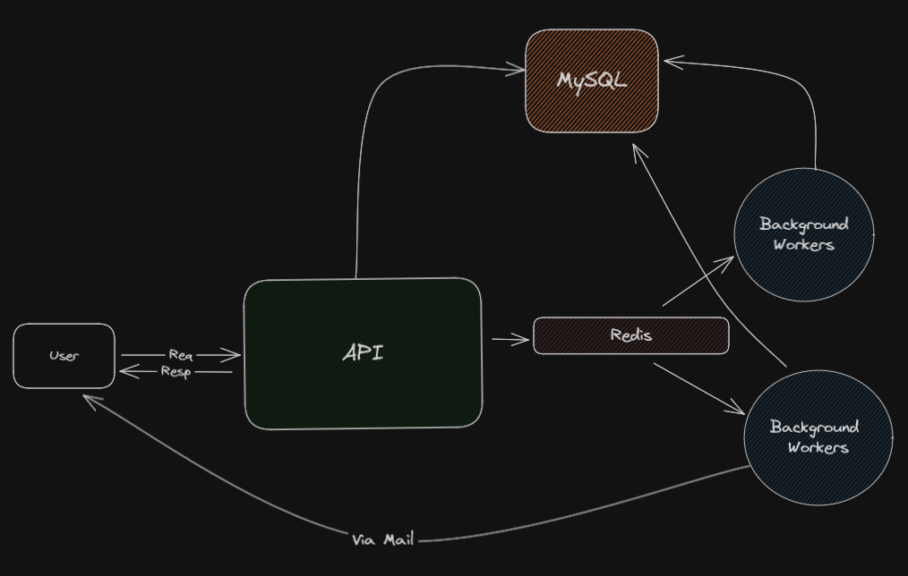

# Dating App Service
This is a dating app service that allows users to create an account, login, and find other users to match with. Users can respond to other users' profiles with `YES` and `NO`.

## Architecture


## Code Structure
```
├───cmd
│   └───dating_app        [Main entry point for the application]
├───config                [Configuration files]
├───constants             [Constants used throughout the application]
├───internal              [Internal packages]
│   ├───app               [Application logic and server setup]
│   ├───controllers       [Controllers for handling HTTP requests and routing]
│   ├───dto               [Data transfer objects]
│   ├───handlers          [Handlers for business logic] 
│   │   ├───v1            [Version 1 handlers]
│   │   └───v2            [Version 2 handlers]
│   └───middleware        [Middleware for handling HTTP requests]
├───logger                [Logger configuration]  
├───pkg                   [External packages]
│   ├───mail              [Mail package for sending emails]
│   ├───sql               [SQL package for handling database operations]
│   │   ├───migrations    [Database migrations]
│   │   ├───query         [SQL queries]
│   │   └───sqlc          [SQLC generated code]
│   ├───token             [Token package for handling JWT tokens]
│   └───worker            [Worker package for handling background jobs]
│       ├───distributor   [Distributor for distributing jobs]
│       └───processor     [Processor for processing jobs]
├───scripts               [Scripts for running the application]
└───utils                 [Utility functions]
```
This strucutred is heavily inspired by the NestJS and Spring Boot frameworks. The app, controllers, handlers, and middleware packages are used to separate concerns and make the codebase more modular and maintainable. The `v1` and `v2` packages are used to separate different versions of the API. The `pkg` package is used to store external packages that are not specific to the application. The `sql` package is used to store all database related code. The `worker` package is used to store all background job related code.

## Tools Used
- SQLC: SQLC is used to generate Go code from SQL queries. This allows for type-safe database operations and reduces the amount of boilerplate code needed to interact with the database.
- Migrate: Migrate is used to handle database migrations. This allows for versioning of the database schema and makes it easy to manage changes to the database over time.
- Viper: Viper is used for configuration management. It allows for configuration to be loaded from multiple sources (e.g., environment variables, config files) and provides a simple API for accessing configuration values.
- Asynq: Asynq is used for handling background jobs. It provides a simple API for defining and processing background jobs and allows for easy scaling of background job processing.
- Gin: Gin is used as the HTTP framework for handling HTTP requests. It provides a simple and fast API for defining routes and handling requests.

## Technologies Used
- Go: For the backend server
- MySQL: For the database
- Redis: For background job processing
- Docker: For containerization

## Installation
You can simply run docker-compose up to start the application. The application will be available at http://localhost:8080.

If you want to manually run the application, you can follow the steps below:
```bash
make mysql-docker

make redis

go run cmd/dating_app/main.go
```
If you dont want to make random users, you can also run the python script in `scripts` folder to create a users after starting the application.
```bash
python scripts/feeder.py
```

## API Endpoints
[](https://app.getpostman.com/run-collection/34165931-0c4a5274-c7dd-48d9-b4e6-1658bfc83f0d?action=collection%2Ffork&source=rip_markdown&collection-url=entityId%3D34165931-0c4a5274-c7dd-48d9-b4e6-1658bfc83f0d%26entityType%3Dcollection%26workspaceId%3D1762aed9-119b-4342-b3ac-a088af0f82a9)
- `GET  /dating-app/health`: Health check endpoint
- `POST /dating-app/v1/users/create`: Create a new user [Deprecated]
- `POST /dating-app/v2/users/create`: Create a new user and also setup a row in the `rankings` table for attractiveness ranking
- `GET  /dating-app/v2/users/create/random`: Create a random new user and also setup a row in the `rankings` table for attractiveness ranking
- `POST /dating-app/v1/login`: Login a user using email and password
- `POST /dating-app/v1/swipe`: Api route to swipe on a user, either `YES` or `NO` along with the user's id is required [Deprecated]
- `POST /dating-app/v2/swipe`: Similar to v1 but also starts a background job to calculate the attractiveness score and a job to send mails on a match
- `GET  /dating-app/v1/users/discover`: Get all users that the current user has not swiped on [Deprecated]
- `POST /dating-app/v2/users/discover`: Similar to v1 but also support filtering and sort the users based on attractiveness score

## Bonus Tasks
### Discover V2 API
The `POST /dating-app/v2/users/discover` API supports filtering and sorting of users based on the attractiveness score. The API takes the following query parameters:
```JSON
{
    "age": {
        "less_than": 30,
        "greater_than": 22
    },
    "gender": "male"
}
```

All of these fields are optional and will be used to filter the users. The API will return users that match the filter criteria and sort them based on the attractiveness score.
Some of the possible filter criteria are:
```JSON
{
    "age": {
        "less_than": 30,
        "greater_than": 22
    }
}
```

```JSON
{
    "age": {
        "less_than": 30,
    },
    "gender": "male"
}
```
```JSON
{
    "gender": "male"
}
```
```
{JUST SEND AN EMPTY BODY IF YOU WANT TO GET ALL USERS}
```

### Attractiveness Score Calculation
The attractiveness score is calculated based on other users' interactions with the user's profile. The score is calculated as follows:
```
                        total_likes
attractiveness = ----------------------------
                 total_dislikes + total_likes
```
It is a simple approach but can be improved by adding more factors like the number of times the user has been swiped on, the number of messages received, etc. I have added a background job to calculate the attractiveness score for each user and store it in the `rankings` table. When ever the SWIPE API is called, an event is published to the redis channel and the processor picks up the event and calculates the attractiveness score for the user. It's using `DEFAULT` queue for this with default priority. This is built in such a way that if we are to later add complex operation to calculate the attractiveness score, we can easily configure the processor and remain concistent.

### Email Sender on Match
When two users swipe `YES` on each other, a background job is started to send an email to both users informing them of the match. The email contains the user's name and email address. The email is sent using the `mail` package and the `CRITICAL` queue is used for this with high priority.

### Correlation ID
A correlation ID is generated for each request and added to the request context. This correlation ID is used to track the request throughout the application and is added to the logs for each request. This helps in debugging and tracing requests through the application and also in microservices and distributed systems. The correlation ID is generated using the `uuid` package and is added to the request context using a middleware. The correlation ID is then added to context which is then passed through the request and response cycle. The logger is able to pick up the correlation ID from the context and add it to the logs.

## Further Improvements
- Add more fields to the user profile
- Add more complex logic to calculate the attractiveness score
- Use [Mockgen](https://github.com/uber-go/mock) to generate SQL and Worker mocks for testing
- Support gRPC and support both REST and gRPC APIs